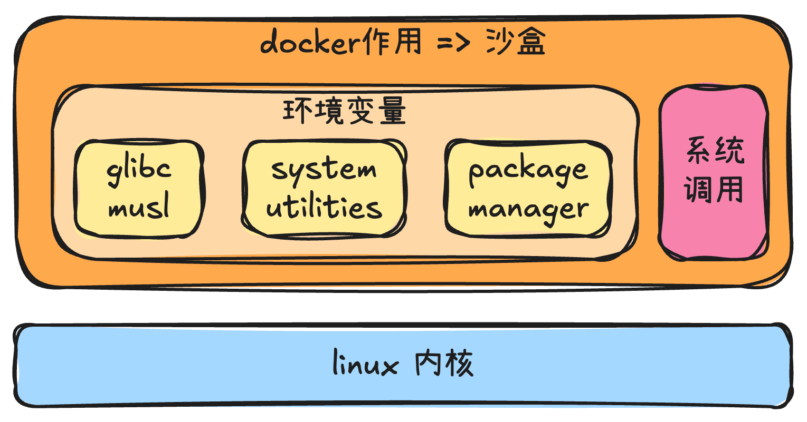

# 从容器clone3的报错来重新学习Docker

## 起因

tileservice 报错：<jemalloc>: arena 0 background thread creation failed (1)

这里的（1）代表操作 clone3 被 seccomp 拦截。

clone3是进程创建的东西，是linux 5.3引入的东西。这里说是docker拦截了这个操作。

这里就给我留下了一个问题：
为什么 docker 会拦截这个操作？docker 和容器之间的关系是什么？容器如果像虚拟机，按道理为什么会受到 docker 的拦截？docker 这里的角色到底是什么？带着这些问题，我开始探索自己原本不了解的内容。

## docker到底是什么？

> Docker is written in the Go programming language and takes advantage of several features of the **Linux kernel** to deliver its functionality. Docker uses a technology called **namespaces** to provide **the isolated workspace** called the container. When you run a container, Docker creates a set of namespaces for that container.
>
> These namespaces provide **a layer of isolation**. Each aspect of a container runs in a separate namespace and its access is limited to that namespace.
>
> 出自docker官方文档 https://docs.docker.com/get-started/docker-overview/#the-underlying-technology

一句话来说，每一个容器都是宿主机内核(Linux kernel)+独立的命名空间(namespaces)。所有的系统调用还是基于宿主机的内核。

因此这里跟传统的虚拟机是大不一样的，虚拟机（VM）= 真正模拟整套硬件 + 虚拟内核，它甚至会模拟 BIOS。

docker 这样设计的好处就是性能快。虚拟机需要模拟硬件，比如模拟 CPU、内存控制、内核。每次控制都要经历转换过程，例如 guest kernel → hypervisor → host kernel，类似中文翻译英文，需要中间多一道环节。docker 为什么更快？因为它始终在宿主机上直接运行，双方都用同一种“语言”交流。

## docker在不同设备下的运行情况（optional）

上面提到 docker 会快，是因为它始终运行在宿主机内核上，但在不同设备上的运行形态并不一致。

- mac 和 Windows 比较特殊，都会在系统里运行一个 VM。
  - mac：macOS 内核和 Linux 不一样，会通过 Hypervisor 充当“传话筒”
  - Windows：同样是跑一个 Linux 虚拟机

只有linux系统中的docker是纯粹使用的宿主机的内核，性能利用率最高的。

相关的信息：

1. 在 Docker 官方博客中提到：“A secure, optimized Linux VM that runs Linux tools and containers.” 明确说 Docker Desktop 在 mac 和 Windows 上使用 Linux VM。—— https://www.docker.com/blog/the-magic-behind-the-scenes-of-docker-desktop/?utm_source=chatgpt.com
2. Docker 官方文档关于 Windows 的 WSL2 后端：“WSL 2 adds support for ‘Linux distributions’ to Windows, where each distribution behaves like a VM …” 说明 Windows 上的 Linux 容器跑在“像 VM 一样”的环境里。—— https://docs.docker.com/desktop/features/wsl/?utm_source=chatgpt.com
3. 关于 Mac 架构：“It runs on a LinuxKit VM …” 表示在 Mac 上使用基于 LinuxKit 的 VM，而不是直接运行在 macOS 内核。—— https://collabnix.com/docs/docker-desktop/architecture-of-docker-desktop-for-mac-18702/?utm_source=chatgpt.com
4. Docker 社区讨论也提到：“Having a virtual machine is required on Windows and MacOS if you want to run Linux containers.”—— https://forums.docker.com/t/difference-between-docker-desktop-and-docker-engine/124612?utm_source=chatgpt.com
