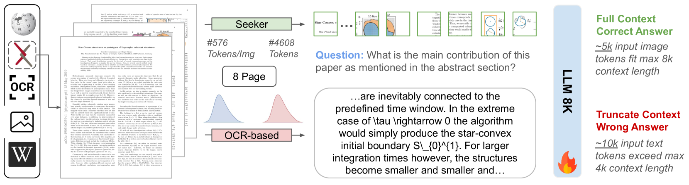

最近DeepSeek出了一篇新的文章：DeepSeek-OCR，这是一项推动文本token压缩的一项工作，整体思路也很清晰。

大概就是一个加满文本的图片，和embed这些文本两者之前的消耗，后者远小于前者。

这里面引入一个24年的paper：From Text to Pixel: Advancing Long-Context Understanding in MLLMs，这篇工作是University of California, Santa Barbara的工作。

一张图片有4608个token，但是将它embed仅需576个token来表达。这明显就减少了token的消耗，确实是一个很不错的工作。
